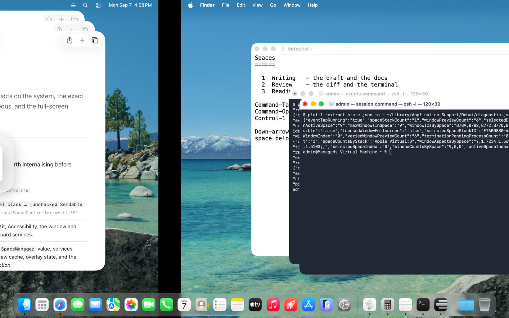
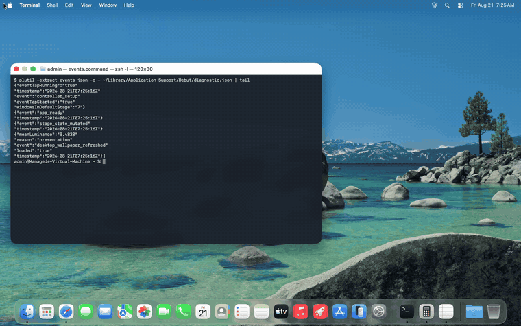
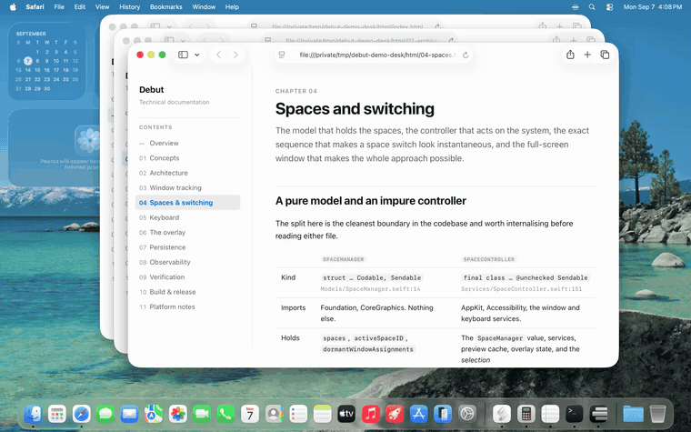
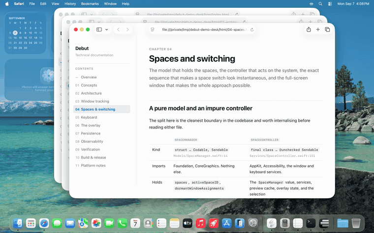
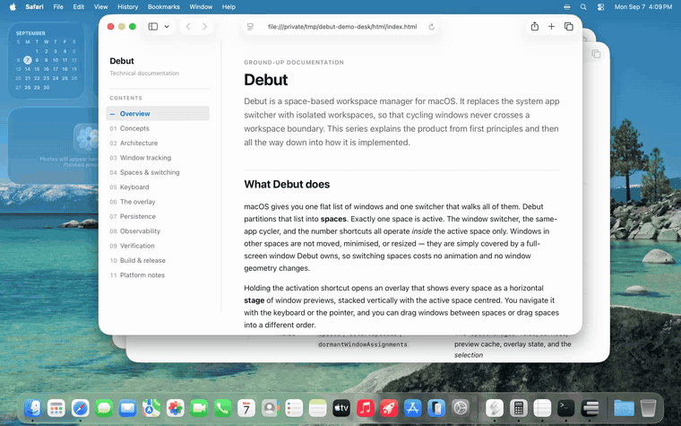

<div align="center">

# Debut

**A stage-based workspace manager for macOS.**
<br>
Cmd-Tab stops showing you every window you own and starts showing you the three you are working with.

[](https://github.com/thomplth/debut/actions/workflows/release-daily.yml)
[](https://github.com/thomplth/debut/releases/latest)




</div>

## Why

The native app switcher shows every window on the machine, so the cost of a context
switch grows with everything you have open, not with what you are doing.

Debut splits the machine into **stages** — small sets of windows, one per task — and
scopes switching to the active one. The guarantee is short:

> **No keyboard-driven switching ever crosses a stage boundary.**

Cmd-Tab cycles inside the active stage. ``Cmd-` `` cycles the current app's windows
inside the active stage. Nothing you press by reflex can land you in yesterday's work.

## In use

**Switch stages.** Hold Cmd-Option-Tab to bring up the plates and step through them.
The active stage sits centred at full size; the others scale down above and below it.



**Cycle windows.** Hold Cmd-Tab. The selection starts on the *second* most recent
window, so a single tap goes back to where you just were — and it never leaves the
stage.



**Jump straight there.** Control-1 through Control-9 switch stage with no overlay at
all — the digit is the stage's position, and a stage that does not exist yet does
nothing.



**Reorganise without leaving the keyboard.** Inside the overlay, the arrow keys move
the selected window between stages, and the selection travels with it.



The pointer works too: drag a preview onto another plate to move that window.

## Install

Download `Debut.dmg` from the [latest release](https://github.com/thomplth/debut/releases/latest),
drag Debut to Applications, and launch it. Debut lives in the menu bar and has no Dock
icon.

On first launch it asks for two permissions:

| Permission | Used for |
| --- | --- |
| **Accessibility** | Enumerating windows, reading titles, raising the active stage |
| **Screen Recording** | Rendering the window previews on the plates |

Both are local. Nothing Debut reads leaves the machine — see [Privacy](#privacy).

Requires **macOS 26 (Tahoe)**.

<details>
<summary>Build it yourself</summary>

```bash
git clone https://github.com/thomplth/debut.git
cd debut
./scripts/build-app.sh          # produces .build/Debut.app
cp -R .build/Debut.app /Applications/
```

The build script signs with a self-signed local certificate so that Accessibility
permission survives rebuilds, and creates one if it is missing.

</details>

## Shortcuts

Every binding below is a default and every one is editable in Settings.

**Anywhere**

| Shortcut | Action |
| --- | --- |
| `⌘ Tab` | Cycle windows in the active stage — tap to switch, hold for the overlay |
| `⌘ ⇧ Tab` | The same, backwards |
| `⌘ ⌥ Tab` | Cycle stages — tap to switch, hold for the overlay |
| `⌘ ⌥ ⇧ Tab` / ``⌘ ⌥ ` `` | The same, backwards |
| ``⌘ ` `` / ``⌘ ⇧ ` `` | Cycle the current app's windows, within the active stage |
| `⌃ 1` … `⌃ 9` | Jump straight to a stage, no overlay |

A *tap* — releasing before the hold delay — switches without ever drawing the
overlay. Holding past it presents the plates.

**While the overlay is up**, with the activation modifier still held:

| Key | Action |
| --- | --- |
| `Tab` / `⇧ Tab` | Next / previous window |
| `⌥ Tab` / `⌥ ⇧ Tab` | Next / previous stage |
| `1` … `9` | Jump to that stage — `9` means the *last* one |
| `←` `→` | Reorder the window inside its stage |
| `↑` `↓` | Move the window to the stage above or below |
| `Q` | Quit the selected app |
| `Esc` | Close the overlay without ending the session |

Releasing the modifier commits the selection. Esc closes the overlay but keeps the
session alive, so the next navigation key brings it straight back.

## How it works

**Stages hold windows, not apps.** One app can have windows on several stages at
once — the browser window you need for this task, and the four you do not.

**Stages are not named.** A stage's label is its 1-based position, so adding or
removing a desktop needs no bookkeeping and no rename step.

**A stage is a real macOS desktop.** Stage 3 is desktop 3, and macOS — not Debut — is
the source of truth for which desktop a window is on. Switching a stage is therefore
one composited transition drawn by the window server, so the whole stage appears at
once instead of its windows being raised one by one. Debut follows desktops it did not
switch, so Mission Control and Control-Arrow stay in sync.

**Switching is a gesture Debut forges.** macOS offers no supported way to change
desktop on demand, so Debut synthesises the trackpad swipe — a technique from
[InstantSpaceSwitcher](https://github.com/jurplel/InstantSpaceSwitcher) by way of
[Space Rabbit](https://github.com/Tahul/space-rabbit) — and drives its progress on a
timer rather than handing the transition to the Dock. That is what lets the switch
setting be a duration in milliseconds, from an instant cut up to a slide you can
follow.

**Moving a window between stages does not move your cursor.** The reassignment goes
through the window server directly and settles in a few milliseconds. Nothing is
dragged, nothing is minimised, and your session stays on the desktop it was on.

**Layout survives quitting and rebooting.** Assignments persist by bundle ID and
window title, with a bundle-only fallback because titles are not stable keys —
terminal prompts, browser tabs and Slack channels all change between sessions. When
an app quits, its windows go *dormant* rather than being forgotten, and a later
launch reclaims them.

**The overlay follows the focused window**, not the display macOS calls main, and it
is presented inside a full-screen app's Space.

**Nothing polls.** Window discovery, focus tracking and MRU ordering are driven by
Accessibility notifications and workspace events. There are no timers.

## Settings

A single scrolling window with a sidebar, opened from the menu bar item.

- **Appearance** — glass style, plate geometry, and the preview refresh policy.
- **Excluded Apps** — apps the stage manager ignores entirely, applied immediately
  across discovery, launch, activation, reconciliation and tracking.
- **App** — launch at login, via `SMAppService`. Overlay animation follows the system
  Reduce Motion setting rather than a toggle of its own.
- **Privacy** — the anonymous-telemetry switch, with a preview of the exact payload.
- **Keyboard Shortcuts** — every action is rebindable by clicking a row and pressing
  the combination; conflicts are caught inline. Also holds the overlay hold delay,
  the command hints, and the quick-switch modifiers and exclusions.
- **Troubleshooting** — export a diagnostic snapshot, or reset the window cache.
- **About** — icon, name, version.

Command hints label the overlay's available commands and, on `Automatic`, retire
themselves once you have used a command more than three times.

## Privacy

Accessibility and Screen Recording are used locally and only locally. Screenshots,
window titles, app names, bundle IDs, window and process IDs, paths and raw
diagnostics are never transmitted.

Anonymous performance sharing is on by default and is a single switch in
**Settings → Privacy**, which also shows you the exact payload before you decide.
What it sends is bucketed operation counts and latency ranges — no trace ID, no exact
timings, and no persistent user or installation identifier. Turning it off deletes
anything still queued. The local `diagnostic.json` is never uploaded. Full disclosure
in [docs/privacy.md](docs/privacy.md).

## Development

```bash
swift test --no-parallel        # unit and screenshot tests
./scripts/rebuild.sh            # build, install, relaunch
./scripts/tart-e2e.sh run       # headless end-to-end suite in a Tart VM
```

`--no-parallel` is required rather than preferred: several suites block the main
thread, so parallel runs fail on timing instead of behaviour.

### High-risk verification

End-to-end coverage is reserved for high-risk changes — global keyboard handling,
Accessibility integration, window lifecycle, overlay presentation, persistence
reconciliation, installation and signing. Everything else is served by the unit and
screenshot tests. See [docs/local-e2e.md](docs/local-e2e.md).

The README's screenshots and clips are captured by `scripts/demo-capture.sh`, which
drives a real macOS desktop inside that same VM. Nothing in `docs/media` is a mockup.

### Documentation

| | |
| --- | --- |
| [docs/html](docs/html) | The full technical guide — concepts, architecture, tracking, persistence, verification. Open `index.html` locally |
| [spec/stage-manager.md](spec/stage-manager.md) | Overlay layout, activation, navigation, stage management |
| [spec/behaviors.md](spec/behaviors.md) | Assignment rules, isolation, persistence, reconciliation |
| [spec/settings.md](spec/settings.md) | Settings sections and behaviour |
| [AGENTS.md](AGENTS.md) | Architecture constraints, toolchain, task workflow |

## License

Debut is free software licensed under the
[GNU General Public License version 3 only](LICENSE) (`GPL-3.0-only`). You may
use, study, modify and redistribute it under those terms. Source corresponding
to every official build is available from that release's tag.

## Releases

Releases are automated and always gated on the full CI and end-to-end suites. Release
notes are the commit subjects in the range, and each release attaches a `Debut.dmg`.

- **Daily** — a scheduled run bumps the patch number and publishes whenever `main` has
  moved since the last tag. It skips silently when nothing has landed.
- **Manual** — the *Manual Release* workflow, with a `minor` or `major` bump.

The version comes from the tags alone. A build reporting `0.0.0-dev` is telling you it
is not a release.
