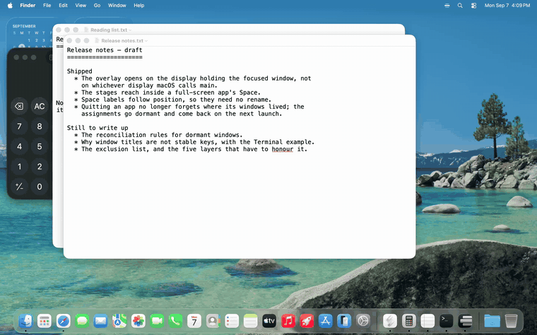
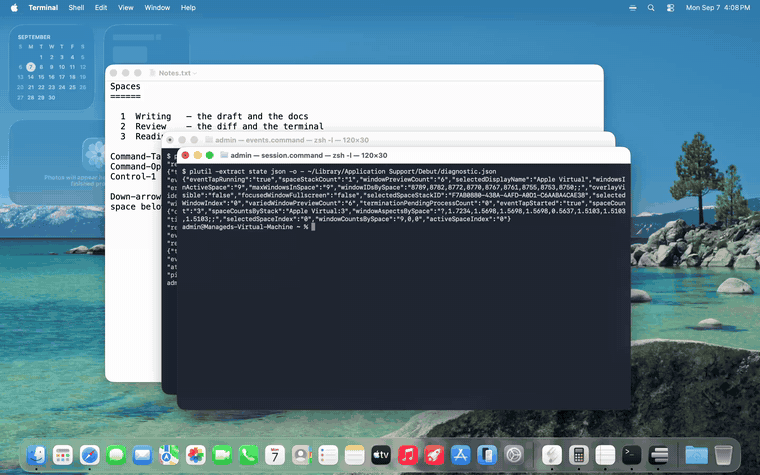

<div align="center">

# Debut

**See your windows. Focus your workspace. Switch desktops faster.**

A visual window switcher for macOS that makes each desktop a workspace.

[](https://github.com/thomplth/debut/actions/workflows/release-daily.yml)
[](https://github.com/thomplth/debut/releases/latest)


</div>

## Recognize the window you want

See screenshot previews in both switchers, instead of choosing by an app icon alone.
**Command-Tab** opens your workspace; **Option-Tab** opens one list of windows across
all desktops. Hold the modifier to browse, then release to focus your selection.
A quick tap switches without opening the overlay.



## Keep this workspace in focus

Your editor, reference and terminal can share a desktop while everything else stays
on another. **Command-Tab cycles windows on the current desktop**. Command-backtick
cycles windows of the same app on that desktop.

Need something elsewhere? Option-Tab deliberately crosses desktops, or use
**Command-Option-Tab** to browse workspaces.




## Get to the next workspace faster

**Control-1 through Control-9** jump directly to a desktop. You can also let Debut
handle **Control-left/right** and your **trackpad desktop swipe**, independently.
The trackpad option uses the three- or four-finger gesture selected in macOS.

Set the switch duration from **Instant** to **400 ms per desktop crossed**.
Only interactions handled by Debut use this duration. Mission Control and other
trackpad gestures retain their normal behavior.


## Put each window where it belongs

In the workspace overlay, drag a window preview onto another desktop's card, or
use Up/Down while holding the activation modifier. Left/Right reorder windows
inside the workspace. One app can have windows on several desktops.


Debut's spaces **are your real macOS desktops**, in the same order. Add or remove
desktops in Mission Control. Debut follows changes made outside the app and remembers
window assignments across app quits and relaunches.

## Install and choose your features

Download `Debut.dmg` from the [latest stable release](https://github.com/thomplth/debut/releases/latest),
drag Debut to Applications, and launch it. Requires **macOS 26 (Tahoe), Apple Silicon**.

Onboarding introduces the features and lets you choose what Debut handles. Every
choice remains available in **Settings → Features** and the menu bar. Window previews,
workspace isolation and numbered shortcuts start enabled; Control-arrow and trackpad
interception are opt-in. Turning workspace isolation off restores native Command-Tab
and Command-backtick. Turning previews off uses app icons and titles in the overlays.

Debut is available in the Dock and menu bar. Hide its Dock icon in Settings if you
prefer, and optionally start it at login.

| Permission | Purpose |
| --- | --- |
| Accessibility | Handle shortcuts, track window changes, focus and move windows |
| Screen Recording | Capture window previews and desktop wallpaper locally |

Screen Recording is required for the desktop wallpaper even with window previews off.
Captured images stay in memory on your Mac and are never uploaded.

## Default shortcuts

| Shortcut | Action |
| --- | --- |
| `⌘ Tab` / `⌘ ⇧ Tab` | Next / previous window in this workspace |
| `⌥ Tab` / `⌥ ⇧ Tab` | Next / previous window across desktops |
| `⌘ ⌥ Tab` / `⌘ ⌥ ⇧ Tab` | Browse workspaces forward / backward |
| ``⌘ ` `` / ``⌘ ⇧ ` `` | Next / previous window of the same app in this workspace |
| `⌃ 1` … `⌃ 9` | Switch directly to desktop 1–9 |
| `⌃ ⌥ 1` … `⌃ ⌥ 9` | Switch desktop, preferring a window of the current app |
| `⌃ ←` / `⌃ →` | Previous / next desktop, when enabled |

Activation shortcuts and numbered-shortcut modifiers are editable in Settings.
Control-arrow and the trackpad desktop gesture have separate feature switches.
The same-app numbered shortcut falls back to the destination workspace when that
app has no window there. A number beyond the desktop count does nothing.

While the **workspace overlay** is open, keep the activation modifier held:

| Key | Action |
| --- | --- |
| `Tab` / `⇧ Tab` | Next / previous window |
| `⌥ Tab` / `⌥ ⇧ Tab` | Next / previous workspace |
| `1` … `8` / `9` | Select that workspace / the last workspace |
| `←` / `→` | Reorder the selected window |
| `↑` / `↓` | Move the selected window to an adjacent desktop |
| `Return` | Browse the next display's desktops |
| `Esc` | Dismiss the overlay |

Release the modifier to commit. The all-windows overlay is for selection; workspace
rearrangement commands apply to the workspace overlay.

## Settings

Settings opens on Features and shows one section at a time.

- **Features** — window previews, workspace isolation, individual desktop interactions,
  and desktop switch duration.
- **Keyboard Shortcuts** — custom bindings, numbered-shortcut modifiers, hold delay,
  repeat pacing, and apps that retain their numbered and Control-arrow shortcuts.
- **Excluded Apps** — apps Debut does not manage.
- **App** — launch at login and Dock visibility. Overlay animation follows Reduce Motion.
- **Privacy** — anonymous sharing and a preview of the data being shared.
- **Advanced** — glass style, card sizing, selection appearance, screenshot refresh
  policy and cache lifetime.
- **Troubleshooting** — export diagnostic data or reset window assignments.
- **About** — version and update checks.

## Privacy

Screenshots, window titles, app names, bundle IDs, process and window IDs, paths,
and raw diagnostics are never transmitted.

Anonymous usage and performance sharing is offered during onboarding and is on by
default. It sends bucketed counts and latency ranges without a persistent identifier.
Turn it off in **Settings → Privacy** to discard queued unsent records. That page also
shows the current payload. Local diagnostic exports can include window and app names;
Debut never uploads them automatically. See [the privacy policy](docs/privacy.md).

## Build and develop

```bash
git clone https://github.com/thomplth/debut.git
cd debut
TOOLCHAINS=com.apple.dt.toolchain.XcodeDefault /usr/bin/swift test --no-parallel
./scripts/build-app.sh
cp -R .build/Debut.app /Applications/
```

The build script uses an available local signing identity. Serial tests are required:
several suites exercise main-queue work and cannot reliably run alongside each other.

```bash
./scripts/rebuild.sh          # build, install and relaunch locally
./scripts/tart-e2e.sh run     # full end-to-end suite, only inside headless Tart
./scripts/demo-capture.sh    # record the README screenshots and clips inside Tart
```

High-risk verification (input, Accessibility, desktop switching, window lifecycle, and
presentation) runs in headless Tart. Routine UI and settings changes use unit and
screenshot tests. Never run E2E against the developer’s foreground session.

The demo fixture provisions real desktops through Mission Control before launching
Debut. The images and clips in `docs/media` show the running app and real windows.
See [local E2E setup](docs/local-e2e.md), [settings](spec/settings.md), and
[architecture guidance](AGENTS.md).

Desktop switching uses synthetic DockSwipe events, based on
[InstantSpaceSwitcher](https://github.com/jurplel/InstantSpaceSwitcher) and
[Space Rabbit](https://github.com/Tahul/space-rabbit). Window movement uses the
bridged window server directly, without driving the pointer. Window tracking and
reconciliation use macOS notifications; captures refresh when needed.

## Releases and license

[Stable releases](https://github.com/thomplth/debut/releases/latest) are signed,
notarized and offered through automatic updates. Nightly builds are prereleases
and do not enter the stable update feed. Release workflows gate on CI and E2E and tag
the tested commit. A single explicit release request authorizes a stable patch, minor,
or major release. Nightlies are also Developer ID-signed and notarized, using credentials isolated
from stable automatic-update signing. See [release verification](docs/release-verification.md).
A local build reports `0.0.0-dev`.

Debut is free software under the [GNU GPL version 3 only](LICENSE) (`GPL-3.0-only`). Source for each
official build is available from its release tag.
