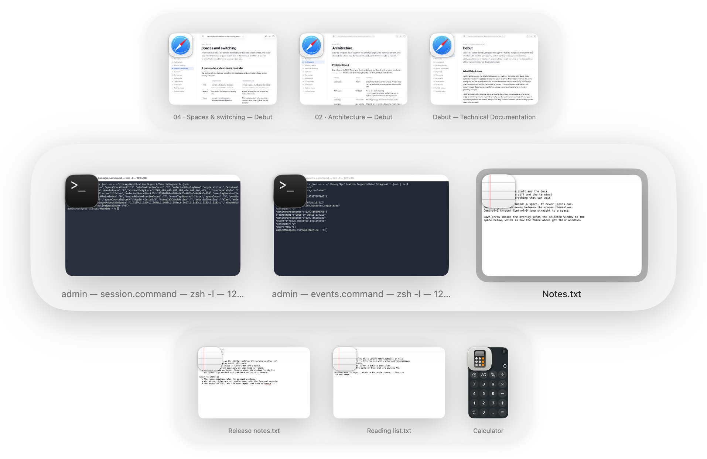
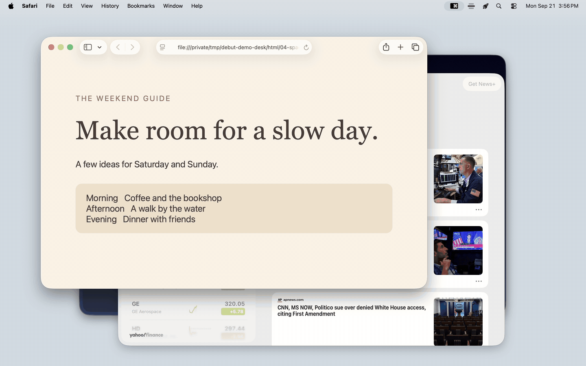

# Debut

A visual window switcher for macOS desktops. Debut complements Mission Control
with window previews, switching within a desktop, and faster navigation between
desktops. Each desktop appears in Debut as a **stage**.

Hold **Command** and press **Tab** to browse windows on your current stage.
Release Command to focus the selected window. Other stages remain visible for
orientation, with their own windows grouped separately.

Debut switches individual windows, so you can choose a specific browser or editor
window on another desktop even when that app also has a window on this one.
Screenshot previews help you recognize the window before switching, much like
Windows Alt-Tab. Keeping everyday Command-Tab cycling within the current stage
keeps windows from other desktops out of that cycle.

- **Option-Tab** shows one list of tracked windows across desktops and displays.
- **Command-Option-Tab** browses stages; **Control-1–9** jumps to a desktop.
- Drag a preview between stages to prepare a window move, then release Command
  to apply it. Escape cancels pending moves.
- **Command-Option-arrow** defaults move the focused window to an adjacent desktop
  and follow it without opening the overlay. These shortcuts are configurable.
- Desktop transitions default to **Instant**. Control-arrow and trackpad desktop
  switching are enabled by default and can be disabled independently in Settings.

Create, remove, and reorder desktops in **Mission Control**. Debut follows those
changes and windows moved through macOS. Stages represent the desktops you
already have; there is no separate virtual workspace or desktop-covering surface.

[**Download Debut**](https://github.com/thomplth/debut/releases/latest) · macOS 26 or later · Apple Silicon

Open the DMG, drag Debut to Applications, and launch it. Grant Accessibility and
Screen Recording for window control and screenshot previews. Previews can be
disabled if you prefer icons and titles.

[Documentation](docs/README.md) · [Contributing](CONTRIBUTING.md) · [Privacy](docs/privacy.md) · [GPL-3.0-only license](LICENSE)

Debut's desktop switching builds on work from
[InstantSpaceSwitcher](https://github.com/jurplel/InstantSpaceSwitcher),
[Space Rabbit](https://github.com/Tahul/space-rabbit), and
[iss](https://github.com/joshuarli/iss). See the
[architecture notes](docs/architecture.md#desktop-switching-and-window-movement)
for how those techniques are used.
