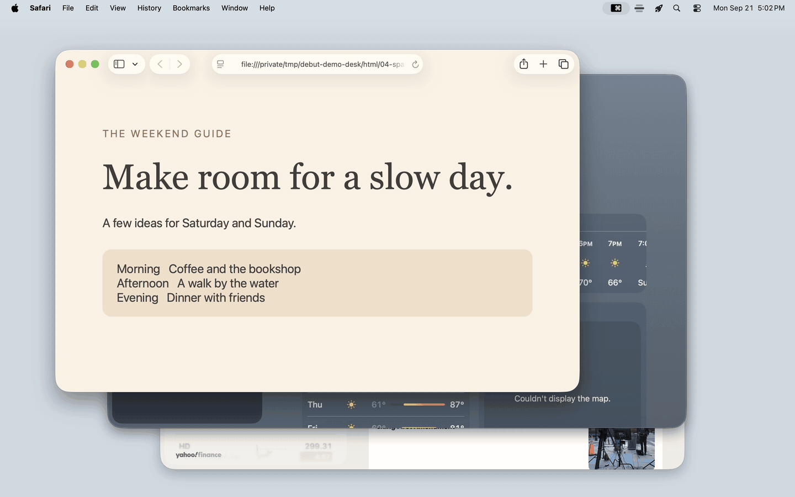
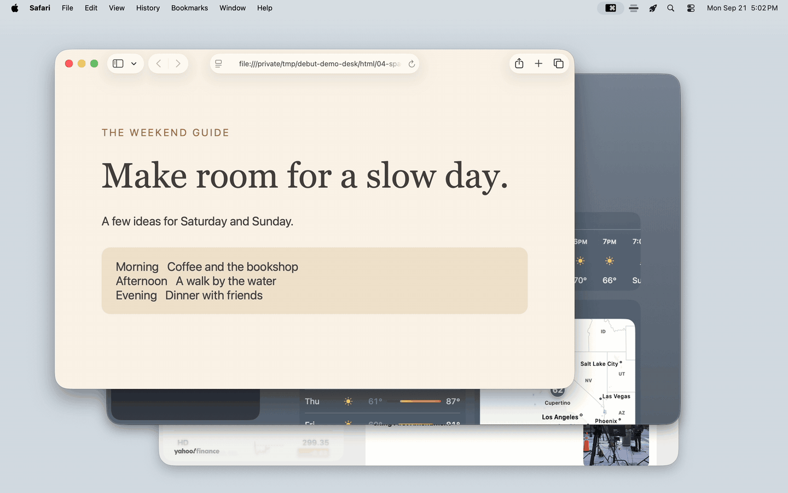
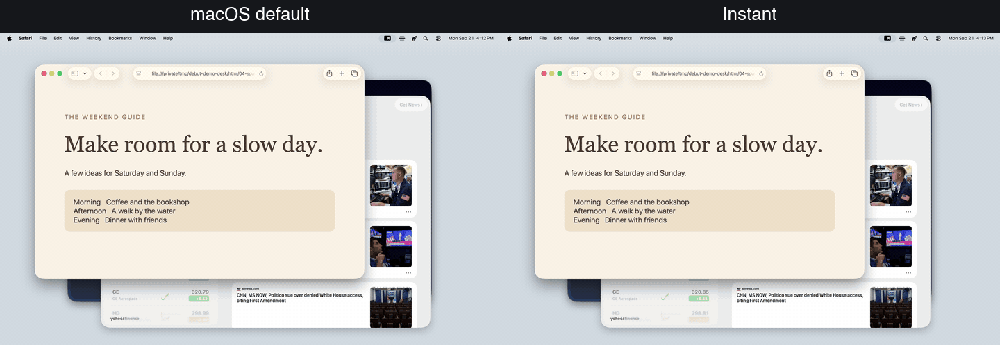

# Debut

Debut turns the macOS Command-Tab switcher into a workspace manager. Preview
individual windows, organize them by space, and switch between spaces faster.

[**Download Debut**](https://github.com/thomplth/debut/releases/latest) · macOS 26 or later · Apple Silicon

## Command-Tab: windows grouped by space

Hold **Command** and press **Tab** to browse window previews in the current space.
Keep Command held and press a **number key** to select a space, or **Option-Tab**
to cycle through spaces. Then use **Tab** to choose a window and release Command
to focus it.

Choose a specific browser or editor window even when the app has windows in
several spaces. Tab cycling stays within the space you've selected.

## Organize windows by space

Move windows between spaces from the same view. While holding Command, press
**↑ / ↓** or drag a preview to another space. Release Command to apply the move;
**Escape** cancels it.

Create and arrange your spaces in Mission Control. Debut follows that layout.

## Option-Tab: see every window

Hold **Option** and press **Tab** to browse one list of windows across spaces
and displays. Release Option to focus your selection.

This view is inspired by Windows Alt-Tab and
[lwouis/alt-tab-macos](https://github.com/lwouis/alt-tab-macos).

## Faster space switching

Choose faster or instant transitions for space switching, including
**Control-← / →** and trackpad gestures. **Control-1–9** jumps directly to a space.

The approach builds on
[jurplel/InstantSpaceSwitcher](https://github.com/jurplel/InstantSpaceSwitcher),
[joshuarli/iss](https://github.com/joshuarli/iss), and
[Tahul/space-rabbit](https://github.com/Tahul/space-rabbit).

## Get started

Open the DMG, drag Debut to Applications, and launch it. Grant **Accessibility**
for window control and **Screen Recording** for window previews. You can disable
previews and use icons and titles instead.

[Documentation](docs/README.md) · [Privacy](docs/privacy.md) · [GPL-3.0-only license](LICENSE)
